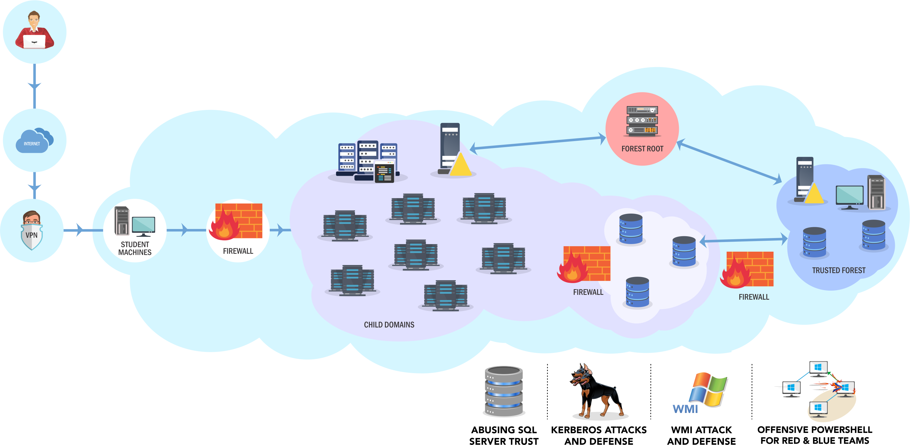

## Windows Red Team Lab and Certified Red Team Expert

This post is just to share my point of view about this lab and this certification.

### whoami

I am just an information security engineer working into the offensive security team performing tasks of ethical hacking, penetration testing and red team operations.

### would you repeat the course and the exam?

Short answer: Absolutely!

### lab description

The lab is called technically [Windows Red Team Lab](https://www.pentesteracademy.com/redteamlab) and is hosted by [Pentester Academy](https://www.pentesteracademy.com). The lab and de exam was designed by [Nikhil Mittal](https://twitter.com/nikhil_mitt) creator of some tools like [Nishang](https://github.com/samratashok/nishang) and [Kautilya](https://github.com/samratashok/Kautilya) among others. Do you know them? xD

The course is all about performing Red Teaming assessment with assume breach mentality and completing the objectives which are like exercise after each topic.

Basically you will start from a student workstation  and antivirus enabled with low privilege user  and a user into the AD and, using only tool or feature included into any Windows system and PowerShell you have to build appropriate attack vectors to compromise a whole realistic AD environment. Apart from compromise all servers within the networks some flags will be requested too in order to train and learn about commons unsecure configurations and get a deep enumeration methodology. As a constructive critic, the flag form as well as the flags formats are a little bit tricky but you can always get a line to the support team to validate flags. They are really nice and helpfull!

You will also learn about countermeasures and remediation techniques for most of the topics covered in the lab which will increase the quality of your reports.

The network lab is very similar that are showed into its web site.

### about the time

If you are already skilled in pentesting or ethical hacking, the 30 days option should be fine for you. If you are so busy or think that will not be enough just go for 60 or 90 days. Also, during COVID-19 pandemic they have made a discount for it. Thanks!

### materials and connection to the lab

One day after make the paymment you will receive the whole course material with the details connection for the lab. you can access it using OpenVPN and a RDP client or just by web.

### course review

Personally, I have found the course and the lab really interesting, I have learn and improved my skills in AD environments. One of the best part is that this is not like other certifications or courses where no train or quality materials are provided. You can follow the videos and documentation and get a full understanding about the topics and how to apply into the lab.

### the exam

The exam is a practical test over 48 hours to achieve the fully forest compromise starting from a student machine with low privileges into the network and a lot of tools restricted. You will be asked to submit a full report expaining the attacks performed along with practical mitigations.

Half an hour before your start time you will receive an email with the VPN details connection to test it in advance. Take into consideration that the exams slots are restricted so if you want a specific date just ask the support team as soon as you know. I had to wait about 5 weeks after the end of the lab.

As a recommendation, you can have in the computer that you will use for the exam a full repository with all the tools used during the lab just to save some time and not lose it downloading the tools.

### final words

Finally after a few hours after submitting my report I got the confirmation by email from Pentester Academy that I have cleared the exam.

Sometimes, ethical hacker are focuses on web, mobile, linux technologies but for most of them Windows environment are always complicated. This course is a very good point to get this skills and grow your knowledge.

Thanks to [Nikhil Mittal](https://twitter.com/nikhil_mitt) for such a good work with this course!
